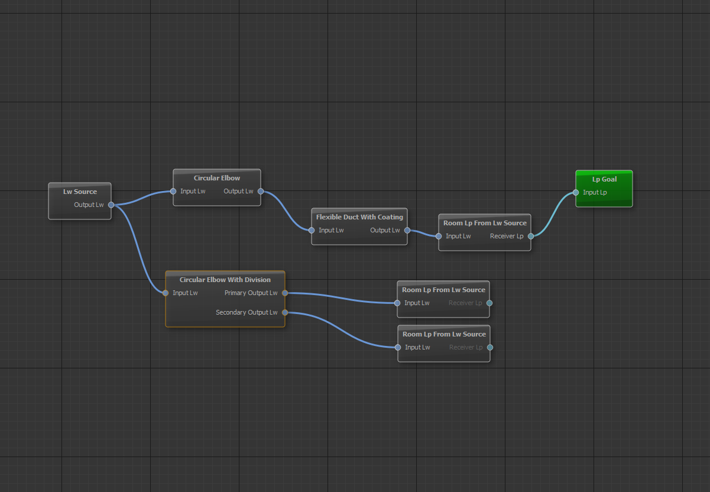
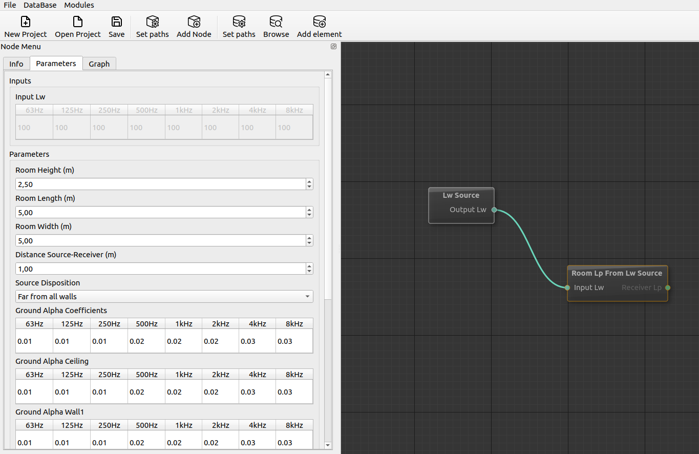
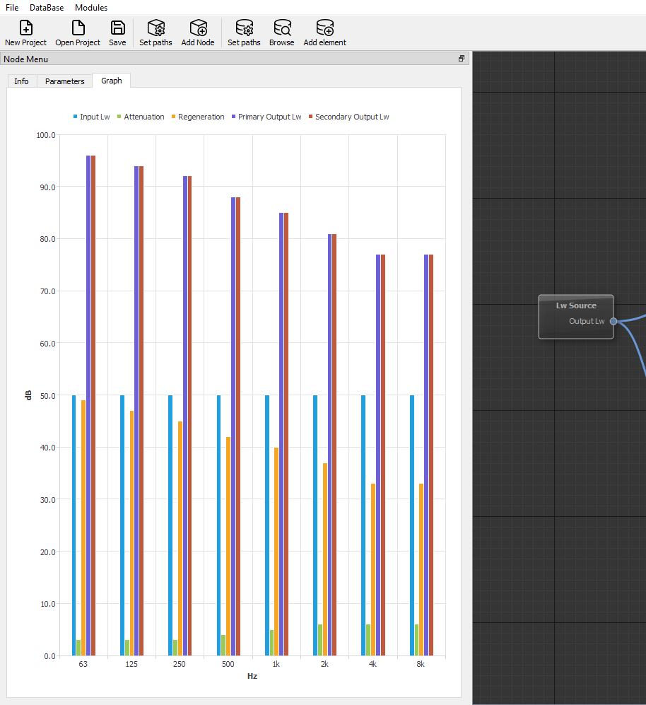
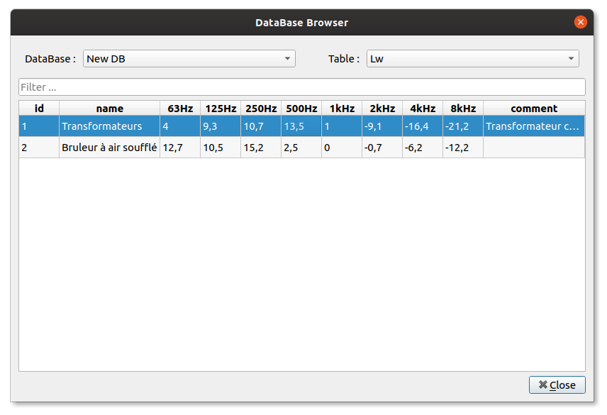

# Chain modules

Connect a chain of modules together and get the result !



# Set the modules parameters

Every modules can have as many options as you want.



# Graph everything

Every spectrum is automatically graphed.



# Integrated Database

Connect one or more SQLite databases and use thoses spectrums in your projects.



# Create your own modules

Modules are created in simple `module.mjs` javascript files. You can create your own in minutes :

```javascript
export const name = 'LwSource';

export const caption = 'Lw Source';

export const inputs = [
];

export const parameters = [
    { id: "param1", type: 'spectrum', typeName: "Lw", description: 'Output Lw', default: [100, 100, 100, 100, 100, 100, 100, 100]},
];

export const readonly_outputs = [
];

export const outputs = [
    { id: "out1", type: 'spectrum', typeName: "Lw", description: 'Output Lw' },
];

export function calculate (inputs, parameters) {
    return {
        "out1": parameters["param1"]
    };
};
```
